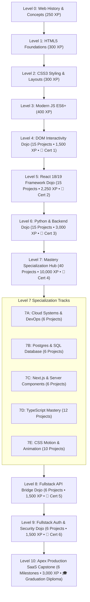

# 📋 Product Requirements Document (PRD) — NoviCodes

> **Version:** 2.5.0  
> **Status:** Production Active & Verified  
> **Platform:** 100% Client-Side Interactive Web Development Platform  
> **Repository:** `RifaiM/NoviCodes` (`CodeRoots`)  

---

## 1. Executive Summary & Vision

### 1.1 Problem Statement
Learning modern web development is overwhelmed by configuration fatigue (npm, bundlers, Docker, API keys, credentials), paywalls, video-only tutorials without hands-on verification, and disconnected lessons that fail to teach how frontend clients, backend microservices, and databases integrate into real-world production software.

### 1.2 Vision & Value Proposition
**NoviCodes** is a frictionless, 100% client-side, browser-native coding academy. Learners progress from raw mental models and foundational HTML/CSS/JS up to architecting multi-tenant SaaS applications, containerized microservices, and fullstack cloud deployments.

- **Zero Setup / Zero Installation:** Write, lint, run, and preview code directly in the browser.
- **100% Open & Free:** No accounts, no subscriptions, zero data tracking or paywalls.
- **Analogy-First & Progate-Inspired Pedagogical Matrix:** Every concept is grounded in real-world metaphors, immediate code checkpoints, interactive diagnostics, and visual targets.
- **Verifiable Proof of Work:** Cryptographic-style high-resolution HTML5 Canvas certificates awarded upon completing milestone tracks.

---

## 2. Target Audience & Personas

| Persona | Background | Primary Goal on NoviCodes | Key Friction Eliminated |
| :--- | :--- | :--- | :--- |
| **Complete Novice (The Builder)** | Zero coding experience, visual learner. | Understand how websites work, write first HTML/CSS/JS page. | No terminal setup, no package managers. |
| **Frontend Explorer (The Apprentice)** | Knows basic HTML/CSS, wants React mastery. | Build interactive stateful SPAs, hooks, custom components. | Pre-configured React 18/19 live in-browser compiler. |
| **Backend & Cloud Aspirant (The Architect)** | Knows frontend, needs Python, APIs, and SQL. | Build FastAPI services, relational databases, Docker containers. | Live simulated terminal and WebAssembly Python runner. |
| **Fullstack Job Seeker (The Challenger)** | Wants production portfolio credentials. | Ship end-to-end SaaS with Auth, PostgreSQL, Stripe, and AI. | Complete Capstone Level 8, 9, 10 with verified diplomas. |

---

## 3. Curriculum & Track Taxonomy (Levels 0 through 10)

### 3.1 Detailed Track Breakdown

| Level | Track Title | Focus Technologies | Projects / Lessons | Bounty XP | Credential |
| :---: | :--- | :--- | :---: | :---: | :---: |
| **0** | Web History & Pillars | Internet packet flow, HTTP/DNS, 4 Web Pillars | 4 Analogy Hubs + Quiz | 250 XP | Foundations Badge |
| **1** | HTML5 Foundations | Semantic DOM, Accessibility (a11y), Forms | Foundations Academy | 300 XP | Foundations Badge |
| **2** | CSS3 Foundations | Box Model, Flexbox, Grid, Responsive Media | Foundations Academy | 300 XP | Foundations Badge |
| **3** | Modern JavaScript | ES6+, Event Loop, DOM API, Async/Await | Foundations Academy | 400 XP | Foundations Badge |
| **4** | DOM Practical Dojo | Vanilla JS, State UI, Canvas Games, Dynamic DOM | 15 Interactive Projects | 1,500 XP | 📜 DOM Certificate |
| **5** | React Framework Dojo | React 18/19, Hooks, State Lifting, Context, SPAs | 15 Interactive Projects | 2,250 XP | 📜 React Certificate |
| **4.5** | DevType Dojo (Arcade) | Symbol Muscle Memory & Typing Speedrun | Infinite Speedrun Mode | Bonus XP | Speedrun Score |
| **6** | Python Backend Dojo | Python 3.12, OOP, Algorithms, Data Structures, APIs | 15 Interactive Projects | 3,000 XP | 📜 Python Certificate |
| **7A** | Cloud Systems & DevOps | Docker, CI/CD, Nginx Reverse Proxy, AWS/GCP | 6 Specialization Projects | 1,500 XP | 📜 Specialization Cert |
| **7B** | Postgres & SQL Arch | Relational Modeling, Indexes, Connection Pooling | 6 Specialization Projects | 1,500 XP | 📜 Specialization Cert |
| **7C** | Next.js Server Eng | App Router, Server Actions, Hydration, SSR | 6 Specialization Projects | 1,500 XP | 📜 Specialization Cert |
| **7D** | TypeScript Mastery | Generics, Narrowing, Utility Types, Smart Inference | 12 Specialization Projects | 3,000 XP | 📜 Specialization Cert |
| **7E** | CSS Motion & Animation | Micro-Interactions, Hardware GPU, Keyframes, Spring | 10 Specialization Projects | 2,500 XP | 📜 Specialization Cert |
| **8** | Fullstack API Bridge | REST & WebSocket Integration, Skeletons, Error Bounds | 6 Fullstack Projects | 1,500 XP | 📜 Level 8 Certificate |
| **9** | Fullstack Auth & Security | JWT, Refresh Tokens, RBAC, Cloud PostgreSQL | 6 Fullstack Projects | 1,500 XP | 📜 Level 9 Certificate |
| **10** | Apex SaaS Capstone | Multi-tenancy, Stripe Billing, AI Engine, Deployment | 6 Enterprise Milestones | 3,000 XP | 🎓 Graduation Diploma |

---

## 4. Key Functional Features

### 4.1 Dual-Lane Interactive IDE Workspace (103 Lessons)
- **Left Lane (Instructions & Pedagogy):**
  - Project Title & XP Bounty Pill.
  - 2-Tier Stacked Foundations Refresher Dropdown with direct new-tab guide links.
  - Progate-style Top Mission Card with live completed task counter (`X / Y`).
  - Target Visual Snippet (Preview of exact expected DOM output).
  - Concrete Code Blueprint & Reference Code Widget with universal one-click clipboard copy and `✅ Copied!` feedback.
- **Right Lane (Sticky Workspace):**
  - File Tab Bar & Safe Reset Code Button (with SweetAlert2 confirmation dialog).
  - Monospace Editor with real-time synchronized line numbers.
  - Live Preview Sandbox (HTML/CSS/JS/React) or High-Contrast Monospace Terminal (Python/SQL/DevOps).
  - Real-Time Diagnostic Lint Panel.
  - Check & Verify Code Action Button with instant error highlighting.

### 4.2 Interactive Foundations Academy (13 Tracks)
- **4-Tab Segmented Architecture:**
  - Tab 1: Analogy & Concepts with live interactive visual engines.
  - Tab 2: Interactive Terms & Glossary Bank.
  - Tab 3: Live Code Sandbox with instant execution.
  - Tab 4: 5-Question Knowledge Check with +300 XP completion confetti.
- **Real-Time Search Engine:** Instant keyword filtering across concepts and glossary terms with clear buttons.
- **Active Tab Persistence:** URL query preservation (`?track=...&tab=...`) across track changes.

### 4.3 Gamification & Rank Progression Engine
- **Developer Rank Ladder:**
  - Level 0: Web Explorer (`0 XP`)
  - Level 1–3: Code Apprentice (`550 XP`)
  - Level 4: DOM Manipulator (`1,250 XP`)
  - Level 5: React Practitioner (`2,750 XP`)
  - Level 6: Python Backend Engineer (`5,000 XP`)
  - Level 7: Fullstack Specialist / Polymath (`8,000 – 15,000 XP`)
  - Level 8: API Integration Specialist (`17,500 XP`)
  - Level 9: Security Engineer (`19,000 XP`)
  - Level 10: Master Web Developer (`21,000+ XP`)
- **Daily Quests & Streaks:**
  - 2-minute daily retention micro-quiz awarding bonus streak XP.
  - Streak freeze and consecutive streak milestones.
- **Idempotent XP Bounty Protection:** Prevents duplicate XP inflation on re-submitting solved challenges.

### 4.4 Anti-Tampering & Sequential Security
- Prerequisite validation blocks URL tampering across all 103 lessons.
- Universal `Ctrl+Alt+D` DevKit & 5-click logo trigger for instant tester unlocking/locking.

### 4.5 Verifiable Proof-of-Work Certificates
- Dynamic HTML5 Canvas generator exporting ultra-crisp 1200x800 PNG certificates and high-resolution print PDFs (`@media print`).
- Personalized recipient name input, unique verification hash (`CR-L[4-10]-XXXX`), and academic board seal.

---

## 5. Non-Functional Requirements (NFRs)

1. **Performance:** Sub-second Time to Interactive (TTI), zero heavy runtime server dependencies (100% pre-rendered static HTML via Astro).
2. **Offline & Refresh Resilience:** Automatic draft preservation via `localStorage` on every keystroke.
3. **Zero Data Harvesting:** 100% client-side privacy; no user cookies or external tracking telemetry.
4. **Fluid Responsiveness:** Strict multi-tier responsive typography and layout calibration supporting viewport widths from 320px up to 4K displays.

